<!-- # 👋 Hello, I'm Sandeepkusshwaha

> **Full-Stack Mobile & Backend Developer** | Building Scalable & User-Centric Solutions

I'm a passionate software developer with expertise in **Android Development**, **Flutter**, and **Backend Technologies**. I've successfully delivered multiple projects and completed internships with industry-leading companies. I love transforming ideas into elegant, efficient solutions that solve real-world problems.

---

## 🎯 About Me

- 🚀 **Full-Stack Developer** specializing in mobile and cross-platform applications
- 💡 **Problem Solver** with a passion for clean code and best practices
- 🎓 **Continuous Learner** always exploring new technologies and methodologies
- 🌟 **Experienced** in working on production-grade applications
- 📱 **Mobile-First Mindset** with deep expertise in Android and Flutter ecosystems

---

## 🛠️ Technical Skills

### **Mobile Development**
- **Android Development** - Java, Kotlin, Android SDK, Material Design
- **Flutter** - Cross-platform mobile development, State Management (Provider, Bloc)
- **Responsive UI/UX** - Creating beautiful and intuitive user interfaces

### **Backend & Databases**
- **Languages** - Java, SQL
- **Databases** - MySQL, Database Design & Optimization
- **API Development** - RESTful APIs, Integration & Testing

### **Tools & Technologies**
- Git & Version Control
- Android Studio, VS Code
- Firebase, Cloud Services
- Agile Development Methodologies

---

## 💼 Professional Experience

- 🏢 **Internship with Top Company** - Gained hands-on experience in production development
- 🚀 **Multiple Featured Projects** - Delivered high-quality applications with excellent user feedback
- 📊 **Strong Problem-Solving Skills** - Specialized in debugging complex issues and optimization

---

## 📊 GitHub Statistics

<div align="center">

[](https://github.com/ryo-ma/github-profile-trophy)

[](https://github.com/anuraghazra/github-readme-stats)


[](https://github.com/Sandy-7061)

</div>

---

## 🌐 Let's Connect

I'm always open to interesting conversations and collaboration opportunities. Feel free to reach out!

<div align="center">

[](https://github.com/Sandy-7061)
[](https://www.linkedin.com/in/sandeep5642/)
[](https://www.facebook.com/SandeepKushwaha)
[](https://www.instagram.com/saim_7024/)

</div>

---

## 📞 Get In Touch

- 💬 **Ask me about:** Development, Mobile Apps, Backend Solutions, Best Practices
- 📧 **Phone:** [+91 7024520740](tel:+917024520740)
- 😊 **Pronouns:** He / Him

---

<div align="center">

### ⭐ Thanks for visiting! Don't forget to star my repositories if you find them helpful 🚀

</div>
 -->


<!-- ╔══════════════════════════════════════════════════════════════════════════╗ -->
<!-- ║              SANDEEP KUSHWAHA — GITHUB PROFILE README                  ║ -->
<!-- ╚══════════════════════════════════════════════════════════════════════════╝ -->

<div align="center">

<!-- ── ANIMATED HEADER ─────────────────────────────────────────────────── -->


<!-- ── ROTATING TYPED IDENTITY ─────────────────────────────────────────── -->


<!-- ── SOCIAL LINKS ─────────────────────────────────────────────────────── -->
<br/>
<a href="https://linkedin.com/in/sandeep5642"></a>
<a href="mailto:sandeepkush880@gmail.com"></a>
<a href="https://github.com/Sandy-7061"></a>


</div>

<br/>

---

<div align="center">
<h2>⚡ What I Build & Who I Am</h2>
</div>

```yaml
# ═══════════════════════════════════════════════════
#   sandeep-kushwaha.yaml  ·  Full Stack Profile
# ═══════════════════════════════════════════════════

identity:
  name:        "Sandeep Kushwaha"
  title:       "Backend Engineer + AI Developer + Flutter Dev + UI/UX Designer"
  company:     "BridgeLogic Software Pvt. Ltd."
  experience:  "2+ years · 6 companies · shipped to production"
  education:   "B.Tech CSE · 7.01 CGPA · 2021–2025"

what_i_build:
  backend_systems:
    - "Microservice architectures   → Java 17 · Spring Boot 3 · Docker · Redis"
    - "RESTful & real-time APIs     → JWT auth · WebSocket · Swagger docs"
    - "Scalable databases           → PostgreSQL · PostGIS · MySQL · Spring JPA"
    - "Cloud integrations           → AWS S3 · Firebase · FCM push notifications"

  ai_applications:
    - "LLM integrations            → Gemini API · OpenAI · prompt engineering"
    - "AI-powered mobile apps      → text-to-image · speech-to-text · TTS"
    - "Intelligent chatbots        → context-aware conversation systems"
    - "ML feature integration      → recommendation · auto-classification"

  mobile_apps:
    - "Flutter cross-platform      → iOS + Android from one codebase"
    - "Third-party API mashups     → SRDV · Stripe · Firebase · custom APIs"
    - "Real-time chat & messaging  → WebSocket + Firebase Realtime DB"

  ui_ux_design:
    - "Interface design            → wireframes · prototypes · user flows"
    - "Design systems              → consistent components · spacing · typography"
    - "Light/dark theming          → fully adaptive responsive UIs"
    - "User-first thinking         → accessibility · micro-interactions · polish"

superpower: >
  I design the UI, build the API, and ship the app —
  end-to-end from Figma wireframe to production server.

available_for:
  - "Backend / API architecture contracts"
  - "Flutter app development (freelance)"
  - "AI feature integration into existing apps"
  - "UI/UX design + prototype delivery"
  - "Full-stack project ownership"
```

---

## 🛠️ Complete Tech Arsenal

### ⚙️ Backend Engineering
<p>


</p>

### 🤖 AI & Machine Learning
<p>


</p>

### 📱 Mobile Development
<p>


</p>

### 🎨 UI/UX Design
<p>


</p>

### 🗄️ Databases & Storage
<p>


</p>

### ☁️ Cloud, DevOps & Infra
<p>


</p>

### 🌐 Frontend & API Tools
<p>


</p>

---

## 🔥 Production Systems I've Built

<div align="center">

| Domain | System | What it does | Stack |
|--------|---------|-------------|-------|
| 🤖 **AI / Mobile** | **Chimini AI** | Flutter AI chat — Gemini text-to-image, speech-to-text, TTS, responsive light/dark UI | `Flutter` `Gemini` `Firebase` |
| 🍔 **E-commerce** | **Food Ordering** | Full backend — JWT auth, restaurant/food/order roles, MySQL, Postman-tested APIs | `Spring Boot` `MySQL` `JWT` |
| ✈️ **Travel Tech** | **Tickvia** | Multi-service booking app — bus, flight, hotel, cab, recharge via live SRDV APIs | `Flutter` `SRDV API` `Dart` |
| 🛒 **E-commerce** | **Treasurebaazar** | Grocery backend — product catalog, cart, orders, inventory, Swagger docs | `Spring Boot` `JPA` `Swagger` |
| 🌦️ **Utility** | **Weather App** | Android real-time weather — location search, API integration, clean UI | `Android` `Java` `OpenWeather` |
| 💬 **Messaging** | **WhatsApp Connect** | WhatsApp Business API integration for automated messaging | `HTML` `JS` `WA Business API` |
| 🚗 **Travel** | **The Go-Vibe** | Travel companion app with itinerary and booking features | `JavaScript` `Node.js` |
| 🏘️ **Real Estate** | **Shaurya Travels** | Travel services platform | `Flutter` `REST` |

</div>

> 🔒 **NearProp** (real estate platform), **NearByMkt** (SuperApp microservices), **Rudra CRM** (multi-tenant SaaS), and **ERP System** (Onprice) are private client deliverables. Architecture diagrams and code walkthroughs available on request.

---

## 📊 Live GitHub Metrics
> ⚡ **Auto-updated daily** via GitHub Actions — zero manual effort, zero server needed

<!-- ISOMETRIC 3D CALENDAR -->
<div align="center">
<h4>📅 Isometric Commit Calendar (Full Year · 3D)</h4>

</div>

<!-- LANGUAGES + HABITS SIDE BY SIDE -->
<div align="center">
<h4>🈷️ Languages In-Depth &nbsp;&nbsp;&nbsp;&nbsp;&nbsp;&nbsp;&nbsp;&nbsp;&nbsp;&nbsp;&nbsp;&nbsp;&nbsp;&nbsp;&nbsp; 💡 Coding Habits & Activity</h4>


</div>

<!-- ACHIEVEMENTS + STARGAZERS SIDE BY SIDE -->
<div align="center">
<h4>🏆 Achievements &nbsp;&nbsp;&nbsp;&nbsp;&nbsp;&nbsp;&nbsp;&nbsp;&nbsp;&nbsp;&nbsp;&nbsp;&nbsp;&nbsp;&nbsp;&nbsp;&nbsp;&nbsp;&nbsp;&nbsp;&nbsp;&nbsp;&nbsp;&nbsp; ✨ Stargazers Growth</h4>


</div>

<!-- FULL METRICS CARD -->
<div align="center">
<h4>📈 Full Activity Overview</h4>

</div>

<!-- CONTRIBUTION SNAKE -->
<div align="center">
<h4>🐍 Contribution Snake</h4>

</div>

<!-- 3D CONTRIBUTION GRAPH -->
<div align="center">
<h4>🌐 3D Contribution Graph</h4>

</div>

---

## 🎯 Entry Points — Hire Me For

<div align="center">

| If you need… | I deliver… | Timeline |
|---|---|---|
| 🔧 **Backend API** | Spring Boot REST API with JWT, roles, Swagger docs, Postman collection | 1–2 weeks |
| 🤖 **AI in your app** | Gemini/OpenAI integration — chatbot, image gen, voice features | 3–7 days |
| 📱 **Flutter App** | Production-ready iOS/Android app with Firebase + REST backend | 2–4 weeks |
| 🎨 **UI/UX Design** | Figma wireframes, design system, responsive components, prototypes | 3–5 days |
| ⚙️ **Microservices** | Spring Cloud microservice architecture — Docker, Eureka, Gateway | 2–3 weeks |
| 🏗️ **Full Project** | End-to-end: design → backend → mobile app → deployment | Custom |

</div>

---

## 📈 Quick Stats

<div align="center">


</div>

---

## 🏅 GitHub Trophies

<div align="center">

</div>

---

## 🤝 Let's Build Something

<div align="center">

**I'm available for freelance projects, collaborations, and full-time roles.**

💼 Backend contracts · 📱 Flutter apps · 🤖 AI integrations · 🎨 UI/UX design

[](https://linkedin.com/in/sandeep5642)
[](mailto:sandeepkush880@gmail.com)

</div>

---

<div align="center">

<sub>⚡ Metrics auto-update daily · Powered by <a href="https://github.com/lowlighter/metrics">lowlighter/metrics</a> · <a href="https://github.com/Platane/snk">snake</a> · <a href="https://github.com/yoshi389111/github-profile-3d-contrib">3d-contrib</a></sub>
</div>
